<div align="center">

<!-- 3D Rotating Globe Header -->


</div>

<div align="center">

<!-- Animated Holographic Name -->


</div>

<div align="center">

<!-- Multi-line Typing Effect -->


</div>

<br/>

<!-- Neon Divider with Animation -->


<br/>

<div align="center">
  
## 🌌 ABOUT THIS COSMIC ARCHITECT

</div>

<table>
<tr>
<td width="50%" valign="top">


</td>
<td width="50%" valign="top">

```typescript
class HuaThinhHung implements Developer {
  // Personal Info
  readonly name = "Hứa Thịnh Hưng";
  readonly role = "Elite Front-end Developer";
  readonly location = "🌍 Ho Chi Minh City, Vietnam";
  readonly hometown = "🏡 Bạc Liêu Province";
  
  // Core Competencies
  private expertise = {
    frontend: ["React", "Next.js", "TypeScript"],
    styling: ["Tailwind", "SASS", "CSS-in-JS"],
    backend: ["Node.js", "NestJS", "Express"],
    database: ["MySQL", "MongoDB", "Prisma"],
    devOps: ["Docker", "Git", "CI/CD"],
    architecture: ["Microservices", "REST", "GraphQL"]
  };
  
  // Current Mission
  public currentFocus(): string[] {
    return [
      "🎨 Designing breathtaking UIs",
      "⚡ Optimizing for peak performance",
      "🧠 Writing clean, scalable code",
      "🚀 Mastering full-stack ecosystem",
      "💡 Innovating user experiences"
    ];
  }
  
  // Career Trajectory
  public roadmap = {
    foundation: "✅ React + TypeScript Mastery",
    current: "🔥 Next.js + Advanced Patterns",
    nextLevel: "🚀 NestJS + Microservices",
    ultimate: "👑 Full-stack Architect"
  };
  
  // Life Philosophy
  public motto(): string {
    return "Beautiful UI attracts — Solid logic retains 🎯";
  }
}

export default new HuaThinhHung();
```

</td>
</tr>
</table>

<br/>

<!-- Animated Divider -->


<br/>

<div align="center">

## 🛸 TECHNOLOGY UNIVERSE

</div>

<div align="center">

### ⚡ Front-end Arsenal


<br/>


### 🔥 Back-end & Database Power


<br/>


### 🎯 DevOps & Tools Mastery


<br/>


</div>

<br/>

<!-- Animated Divider -->


<br/>

<div align="center">

## 📊 REAL-TIME ANALYTICS & STATISTICS

</div>

<div align="center">

<!-- Main Stats Grid -->


<br/><br/>

<!-- Languages & Activity -->


<br/><br/>

<!-- Activity Graph -->


</div>

<br/>

<!-- Animated Divider -->


<br/>

<div align="center">

## 🏆 ACHIEVEMENTS & TROPHY SHOWCASE

</div>

<div align="center">


<br/>

<!-- Badges Grid -->


<br/><br/>


</div>

<br/>

<!-- Animated Divider -->


<br/>

<div align="center">

## 🌟 PORTFOLIO SHOWCASE - ELITE PROJECTS

</div>

<table width="100%">
<tr>
<td width="50%" valign="top">

<div align="center">

### 🏆 Airbnb Clone Premium


**🎨 Features:**
- ✨ Pixel-perfect UI/UX matching original
- 🔐 Advanced authentication system
- 💳 Payment gateway integration
- 📅 Real-time booking management
- 🗺️ Interactive maps & filters
- 📱 Fully responsive design
- ⚡ Optimized performance

**🛠️ Tech Stack:**
```yaml
Frontend: Next.js 14, TypeScript, Tailwind
Backend: Prisma ORM, MongoDB
Auth: NextAuth.js, JWT
Features: Real-time updates, SEO
```

<a href="#"></a>
<a href="#"></a>

</div>

</td>
<td width="50%" valign="top">

<div align="center">

### 🚀 Full-Stack E-Commerce


**💎 Features:**
- 🛒 Advanced shopping cart
- 💰 Multiple payment methods
- 📊 Admin dashboard
- 📦 Order tracking system
- 🔍 Smart search & filters
- ⭐ Review & rating system
- 📧 Email notifications

**🛠️ Tech Stack:**
```yaml
Frontend: React 18, Redux Toolkit
Backend: NestJS, REST API
Database: PostgreSQL, Redis
DevOps: Docker, Nginx
```

<a href="#"></a>
<a href="#"></a>

</div>

</td>
</tr>

<tr>
<td width="50%" valign="top">

<div align="center">

### 💬 Social Network Platform


**🌐 Features:**
- 👥 Real-time chat & messaging
- 📝 Post, comment, like system
- 🔔 Push notifications
- 👤 User profiles & following
- 📷 Image/video uploads
- 🎨 Beautiful UI animations
- 🌙 Dark/Light theme

**🛠️ Tech Stack:**
```yaml
Frontend: React Native, Expo
Backend: Firebase Realtime DB
Auth: Firebase Auth
Storage: Cloud Storage
UI: Material Design
```

<a href="#"></a>
<a href="#"></a>

</div>

</td>
<td width="50%" valign="top">

<div align="center">

### 🎯 Portfolio & Blog Platform


**✨ Features:**
- 📖 MDX blog with syntax highlighting
- 🎨 Interactive 3D elements
- 📊 Project showcase
- 💼 Resume/CV section
- 📬 Contact form
- 🎭 Smooth animations
- 🔍 SEO optimized

**🛠️ Tech Stack:**
```yaml
Frontend: Next.js 14, Three.js
Styling: Tailwind, Framer Motion
Content: MDX, ContentLayer
Hosting: Vercel, GitHub
Analytics: Google Analytics
```

<a href="#"></a>
<a href="#"></a>

</div>

</td>
</tr>
</table>

<br/>

<!-- Animated Divider -->


<br/>

<div align="center">

## 🐍 CONTRIBUTION SNAKE ANIMATION

</div>

<div align="center">

<picture>
  <source media="(prefers-color-scheme: dark)" srcset="https://raw.githubusercontent.com/HuaThinhHung/HuaThinhHung/output/github-contribution-grid-snake-dark.svg">
  <source media="(prefers-color-scheme: light)" srcset="https://raw.githubusercontent.com/HuaThinhHung/HuaThinhHung/output/github-contribution-grid-snake.svg">
  
</picture>

</div>

<br/>

<!-- Animated Divider -->


<br/>

<div align="center">

## 📡 CONNECT ACROSS THE DIGITAL UNIVERSE

</div>

<div align="center">

<!-- Contact Buttons -->
<a href="mailto:huahung0601@gmail.com">
  
</a>
<a href="https://facebook.com/huahung0601">
  
</a>
<a href="tel:+84866865440">
  
</a>
<a href="https://github.com/HuaThinhHung">
  
</a>
<a href="https://linkedin.com/in/huathinhhung">
  
</a>

<br/><br/>

<table>
<tr>
<td align="center" width="50%">

### 📧 Email
**huahung0601@gmail.com**

</td>
<td align="center" width="50%">

### 📱 Phone/Zalo
**0866 865 440**

</td>
</tr>
<tr>
<td align="center" width="50%">

### 📍 Location
**Ho Chi Minh City, Vietnam** 🇻🇳

</td>
<td align="center" width="50%">

### 🏡 Hometown
**Bạc Liêu Province** 🌾

</td>
</tr>
</table>

</div>

<br/>

<!-- Animated Divider -->


<br/>

<div align="center">

## 💭 INSPIRATIONAL WISDOM

</div>

<div align="center">


<br/><br/>

<table>
<tr>
<td align="center" width="33%">


### ✨ Design Philosophy

> *"Clean UI is not just design —  
> it's an experience that speaks  
> directly to the user's soul"*

</td>
<td align="center" width="33%">


### 🎯 Development Mantra

> *"Code less, build more —  
> focus on impact and value,  
> not complexity for its own sake"*

</td>
<td align="center" width="33%">


### 🚀 Performance Creed

> *"In the cosmos of code,  
> every pixel matters,  
> every millisecond counts"*

</td>
</tr>
</table>

</div>

<br/>

<!-- Animated Divider -->


<br/>

<div align="center">

## 📈 CODING ACTIVITY & TIME TRACKING

</div>

<div align="center">

<!--START_SECTION:waka-->
<!--END_SECTION:waka-->


<br/><br/>

<!-- Productivity Stats -->


</div>

<br/>

<!-- Animated Divider -->


<br/>

<div align="center">

## 🎓 CERTIFICATIONS & LEARNING PATH

</div>

<div align="center">

<table>
<tr>
<td align="center" width="25%">


**HTML & CSS**  
⭐⭐⭐⭐⭐

</td>
<td align="center" width="25%">


**JavaScript**  
⭐⭐⭐⭐⭐

</td>
<td align="center" width="25%">


**React.js**  
⭐⭐⭐⭐⭐

</td>
<td align="center" width="25%">


**TypeScript**  
⭐⭐⭐⭐⭐

</td>
</tr>
<tr>
<td align="center" width="25%">


**Node.js**  
⭐⭐⭐⭐⭐

</td>
<td align="center" width="25%">


**Docker**  
⭐⭐⭐⭐

</td>
<td align="center" width="25%">


**Git & GitHub**  
⭐⭐⭐⭐⭐

</td>
<td align="center" width="25%">


**Databases**  
⭐⭐⭐⭐

</td>
</tr>
</table>

</div>

<br/>

<!-- Animated Divider -->


<br/>

<div align="center">

## 🎯 2025 GOALS & MISSION

```mermaid
graph LR
    A[Current: React Expert] -->|Q1 2025| B[Master Next.js 14]
    B -->|Q2 2025| C[Learn NestJS]
    C -->|Q3 2025| D[Microservices Architecture]
    D -->|Q4 2025| E[Full-stack Architect]
    
    style A fill:#00F7FF,stroke:#FF00FF,stroke-width:3px,color:#000
    style B fill:#00F7FF,stroke:#FF00FF,stroke-width:3px,color:#000
    style C fill:#00F7FF,stroke:#FF00FF,stroke-width:3px,color:#000
    style D fill:#00F7FF,stroke:#FF00FF,stroke-width:3px,color:#000
    style E fill:#FFD700,stroke:#FF00FF,stroke-width:4px,color:#000
```

</div>

<div align="center">



<br/>

### 🎯 Mission Objectives

<table>
<tr>
<td align="center" width="50%">

#### 💻 Technical Goals
- ✅ Master Next.js App Router
- 🔄 Deep dive into NestJS
- 🎯 Learn Microservices patterns
- 🐳 Advanced Docker & K8s
- 🧪 TDD & Testing strategies

</td>
<td align="center" width="50%">

#### 🌟 Personal Goals
- 📚 Contribute to open source
- ✍️ Write technical blogs
- 🎤 Speak at tech events
- 👥 Mentor junior developers
- 🏆 Build 10+ production apps

</td>
</tr>
</table>

</div>

<br/>

<!-- Animated Divider -->


<br/>

<div align="center">

## 🎮 FUN FACTS & HOBBIES

</div>

<div align="center">

<table>
<tr>
<td align="center" width="33%">


### ☕ Coffee Lover
**3-5 cups/day**
